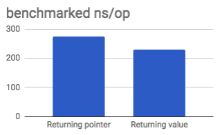
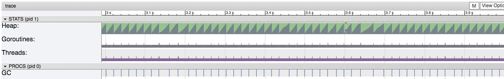
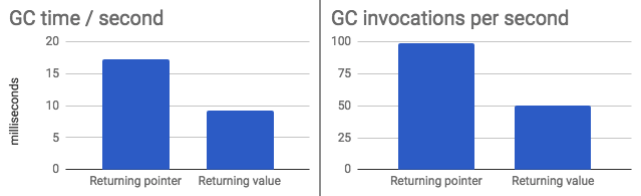

# Go functions: returning structs vs pointers

## TL;DR

Despite copying a struct with several fields is slower than copying a pointer
to the same struct, returning a struct value may be faster than returning a
pointer if we consider _escape analysis_ particularities.

Returning structs allows the compiler to detect that the created data does not
escape the function scope and decides to allocate the memory in the stack, where
the allocation and deallocation is very cheap if compared to managing memory
in the heap. 

## Toy Scenario

Let's consider a machine to create Donuts with diversity of sizes, shapes and
ingredients:

```go
type Donut struct {
    Radius     float32
    Thick      float32
    Toppings   []string
    GlutenFree bool
    Hole       bool
    Filling    string
}
```

In a 64-bit machine, the above struct would have a **minimum** size of
`4+4+16+1+1+12 = 38 bytes`, and I emphasize _minimum_ because some implementations
of Go could decide to, e.g. use bigger data structures for booleans or slice/string
metadata.

Considering that a 64-bit pointer (8 bytes) is several times smaller than 38 bytes,
one may think that the following factory function:
```go
func RandomDonut() *Donut
```
Should be faster than an analogue function that returns a copy of the Donut:
```go
func RandomDonut() Donut
```

## Experiment 1: benchmarking

Given the following function:

```go
const maxToppings = 3

var radiuses = []float32{5, 10, 15}
var thicks   = []float32{2, 3, 4}
var toppings = []string{"Chocolate", "Nuts", "Sugar", "Caramel"}
var fillings = []string{"", "Mermelade", "Chocolate", "Cream"}

var rnd = rand.New(rand.NewSource(321))

func RandomDonut() *Donut {
    d := Donut{
        Radius: radiuses[rnd.Intn(len(radiuses))],
        Thick:  thicks[rnd.Intn(len(radiuses))],
    }
    if rnd.Int()%2 == 0 {
        d.GlutenFree = true
    } else {
        d.GlutenFree = false
    }
    if rnd.Int()%2 == 0 {
        d.Hole = true
    } else {
        d.Hole = false
        d.Filling = fillings[rnd.Intn(len(fillings))]
    }
    numToppints := rnd.Intn(maxToppings)
    d.Toppings = make([]string, 0, maxToppings)
    for i := 0; i < numToppints; i++ {
        d.Toppings = append(d.Toppings,
            toppings[rnd.Intn(len(toppings))])
    }
    return &d
}
```
, and an analogue `func RandomDonut() Donut` function that is exactly equal to the
above function, but returning the Donut by value; we have benchmarked and traced
both versions:

```go
func BenchmarkSweets(b *testing.B) {
    for n := 0; n < b.N; n++ {
        RandomDonut()
    }
}
```

For this particular function, returning a value instead to a pointer makes the
operation time decrease by 16%, as the following graph shows (lower is better): 



Of course the difference may be different depending on the size of the struct
or the total execution time of the function.

## Experiment 2: tracing

The above benchmarks have been repeated and executed during 5 seconds with the
`-trace` option enabled. To allow us inspect the trace with `go tool trace` tool 
(see above screenshot).



The inspection of the `go trace` tool shown that the number of invocations to the
Garbage Collector is cut down by 50%, and the time during which the Garbage Collector
is running is cut in a similar proportion.



These results also would vary on other functions. The example function generates
a small amount of heap memory to store the Donut toppings.

### Conclusions

(Please refer to the TL;DR in the beginning of this entry 😇)

## Next steps

* Evaluate whether arguments by reference make the compiler consider that the
  generated structs escaped the scope of the function that generated it.
* Evaluate from which struct size is faster to return pointers.
* Evaluate how the performance is penalised when structs are returned through
  a larger stack trace.